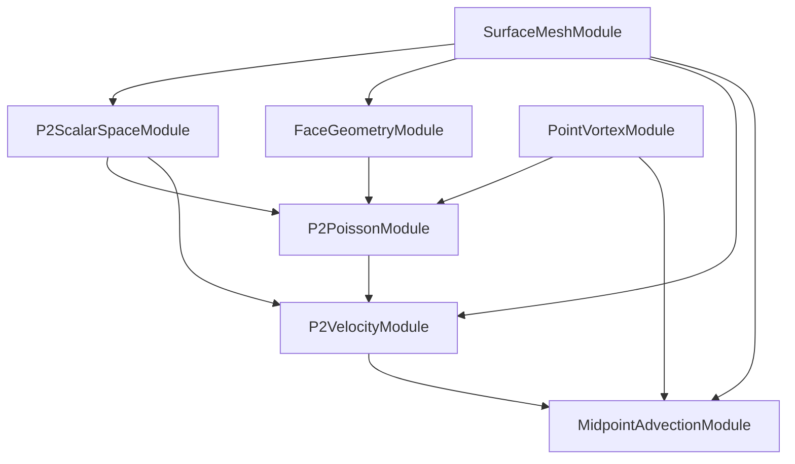

# point_vortex_p2 Architecture and Module Guide

This document explains how `rheidos/apps/point_vortex_p2` works, including the role of each module and how data flows through the solver.

## 1) What This App Does

`point_vortex_p2` simulates point vortices on a triangle mesh using a quadratic (P2) scalar stream function.

Core choices in this implementation:
- P2 scalar FE space (`vertex + edge-midpoint` DOFs).
- CPU sparse assembly/solve with SciPy.
- Pinned gauge (`psi[0] = 0`) for nullspace handling.
- Midpoint particle advection with event-driven face crossing.
- Closed surfaces only; boundary edges are treated as unsupported.

## 2) Runtime Entry Points

### `cook_sop.py`
Single-cook visualization path.
- Input 0: triangle mesh.
- Input 1: vortex points with `p2_face`, `p2_bary`, `p2_gamma`.
- Runs one solve and writes field attributes to the mesh.

### `solver_sop.py`
Stateful solver path.
- Input 0: point-vortex state (feedback geometry).
- Input 1: static triangle mesh.
- Calls `setup(ctx)` once, `step(ctx)` each cook.
- Writes updated vortex state (`p2_face`, `p2_bary`, `P`) and diagnostics.

### `app.py`
Orchestrates modules and Houdini IO.
- `setup(ctx)`: loads mesh and validates closed topology.
- `step(ctx)`: loads mesh + vortices, solves field, advects points, writes outputs.
- `cook(ctx)`: loads mesh + vortices, solves field, writes visualization attrs.

## 3) Data Contract

### Required point-vortex attributes
- `p2_face`: containing face id (`int`)
- `p2_bary`: barycentric coordinates (`vec3`)
- `p2_gamma`: circulation strength (`float`)

### Field outputs
- `p2_stream` (point attr on mesh): stream function sampled at mesh vertices.
- `p2_vel_face` (prim attr): face-centered velocity (`vec3`).
- `p2_vel_corner` (prim attr): flattened 3 corner velocities (`9` floats per face).

### Diagnostic detail attributes
- `p2_diag_residual_l2`
- `p2_diag_rhs_circulation`
- `p2_diag_k_ones_inf`
- `p2_diag_hops_total`
- `p2_diag_hops_max`
- `p2_diag_bary_min`, `p2_diag_bary_max`
- `p2_diag_bary_sum_min`, `p2_diag_bary_sum_max`

## 4) High-Level Compute Flow

Execution in `step(ctx)`:
1. Load mesh and validate closed manifold.
2. Load vortex state (`face`, `bary`, `gamma`).
3. Build/refresh P2 solve (`rhs -> psi`).
4. Build velocity fields (`vel_corner`, `vel_face`).
5. Advect vortices via midpoint method.
6. Write new state and diagnostics.

## 5) Module-by-Module Explanation

## `SurfaceMeshModule` (`modules/surface_mesh`)
Purpose: mesh topology and geometry preprocessing.

Inputs:
- `V_pos` (`(nV,3)`)
- `F_verts` (`(nF,3)`)

Derived resources:
- `E_verts`: unique undirected edges (`(nE,2)`)
- `E_faces`: adjacent faces per edge (`(nE,2)`, `-1` for boundary)
- `F_adj`: per-face neighbor across each opposite edge (`(nF,3)`)
- `F_normal`: face unit normals (`(nF,3)`)
- `F_area`: face areas (`(nF,)`)
- `boundary_edge_count`

How it works:
- Canonicalizes edges as `(min, max)`.
- Builds edge-face incidence and face adjacency.
- Detects non-manifold edges (>2 incident faces) and raises.
- Computes geometry from cross products.

Why it matters:
- `F_adj` drives edge-crossing advection.
- `boundary_edge_count` enforces closed-surface constraint.

## `PointVortexModule` (`modules/point_vortex`)
Purpose: hold vortex state and derived world-space positions.

Inputs/state:
- `face_ids`, `bary`, `gamma` (set from Houdini attrs)

Derived:
- `pos_world` computed from mesh triangle interpolation.

How it works:
- Validates array shapes and matching lengths.
- Converts `(face, bary)` to world position for each vortex.

Why it matters:
- Provides the RHS source state for Poisson.
- Provides particle state consumed by advection.

## `P2ScalarSpaceModule` (`modules/p2_space`)
Purpose: construct global P2 scalar DOF mapping.

Derived resources:
- `edges`
- `face_to_edges`
- `face_to_dofs` with local order `[v0, v1, v2, e01, e12, e20]`
- `ndof = nV + nE`

How it works:
- Each undirected edge owns one midpoint DOF globally.
- Face-local P2 basis maps into global coefficient vector via `face_to_dofs`.

Why it matters:
- This is the indexing backbone for assembly, RHS scatter, and velocity eval.

## `FaceGeometryModule` (`modules/p2_geometry`)
Purpose: precompute affine surface mapping for each face.

Derived resources:
- `J` (`(nF,3,2)`)
- `Ginv` (`(nF,2,2)`)
- `sqrt_detG` (`(nF,)`)

How it works:
- For face `(x0,x1,x2)`, constructs `J = [x1-x0, x2-x0]`.
- Builds metric `G = J^T J`, stores `Ginv` and `sqrt(det(G))`.
- Rejects degenerate faces.

Why it matters:
- Converts reference gradients to surface gradients for P2 FE terms.

## `P2PoissonModule` (`modules/p2_poisson`)
Purpose: assemble and solve stream-function system.

Assembly resources:
- `K` stiffness (sparse CSR)
- `M` mass (sparse CSR)
- `pin_index` (`0`)
- `free_dofs`
- `solver_factor` (cached factorization on free block)
- `k_ones_inf` sanity metric (`||K*1||_inf`)

Solve resources:
- `rhs` (scattered from vortices)
- `psi` (global P2 coefficients)
- `residual_l2`
- `rhs_circulation`

How it works:
- Assembles face local `Ke`, `Me` by quadrature over reference triangle.
- Scatters each vortex contribution as `gamma * phi(local bary)` into `rhs`.
- Solves pinned system on free DOFs with SciPy factorization.

Why it matters:
- Produces the stream function that drives velocity.

## `P2VelocityModule` (`modules/p2_velocity`)
Purpose: convert stream coefficients to tangent velocity field.

Outputs:
- `vel_corner` (`(nF,3,3)`)
- `vel_face` (`(nF,3)`)
- `stream_vertex` (`psi` restricted to vertex DOFs)

How it works:
- Evaluates `grad_Gamma psi` from P2 basis gradients per face.
- Computes `u = n x grad_Gamma psi`.
- Samples velocity at each face corner and centroid.

Why it matters:
- `vel_corner` is the velocity sampler used by midpoint advection.

## `MidpointAdvectionModule` (`modules/midpoint_advection`)
Purpose: advance vortices in `(face, bary)` coordinates.

Inputs:
- mesh (`V_pos`, `F_verts`, `F_adj`)
- `vel_corner`
- vortex state (`face_ids`, `bary`)
- `dt`

Outputs:
- `face_ids_out`, `bary_out`, `pos_out`
- `hops_total`, `hops_max`

How it works:
- Stage A: sample velocity at start and advance half step.
- Stage B: sample velocity at midpoint and advance full step from start.
- Uses event-driven crossing: compute first edge hit from barycentric rates, hop to neighbor face, recompute bary from world point.
- If neighbor is `-1`, raises boundary error.

Why it matters:
- Keeps particles on-surface and robustly handles multi-face motion.

## `fe_utils.py`
Purpose: shared math primitives.

Includes:
- P2 basis and reference gradients.
- barycentric conversions, normalization/clamping.
- barycentric gradient computation on 3D triangles.
- tangent projection utility.

Why it matters:
- Centralizes FE and geometry kernels used by multiple modules.

## 6) Error and Constraint Behavior

- Non-triangular, malformed, or out-of-range indices raise early.
- Non-manifold edges raise in mesh topology build.
- Any boundary edges (`boundary_edge_count > 0`) cause solver setup/load failure.
- Boundary crossing during advection raises runtime error.
- SciPy is required for assembly/solve; missing SciPy raises explicit error.

## 7) How `step(ctx)` Uses the Graph

1. `SurfaceMeshModule.set_mesh(...)`
2. `PointVortexModule.set_state(...)`
3. `P2VelocityModule` get:
   - triggers `P2PoissonModule` solve,
   - which triggers `P2ScalarSpaceModule` + `FaceGeometryModule` + matrix assembly.
4. `MidpointAdvectionModule` get:
   - uses `vel_corner`, `F_adj`, and vortex state to advance.
5. Write outputs to Houdini and publish diagnostics.

Because Rheidos resources are lazy, producers run only when dependencies are stale.

## 8) Test Coverage

`tests/apps/point_vortex_p2/test_p2_pipeline.py` verifies:
- P2 basis partition of unity.
- shared-edge DOF continuity.
- matrix symmetry and `K@1` sanity.
- RHS scatter correctness.
- velocity linear consistency inside a face.
- boundary crossing error behavior.
- integration smoke path for solve + velocity + advection.

## 9) Extension Points

If you extend this app, typical next steps are:
- replace pinned gauge with constrained mean-zero solve.
- add self-velocity correction path.
- add higher-order quadrature for mass assembly if needed.
- add alternate advection integrators (RK, symplectic variants).
